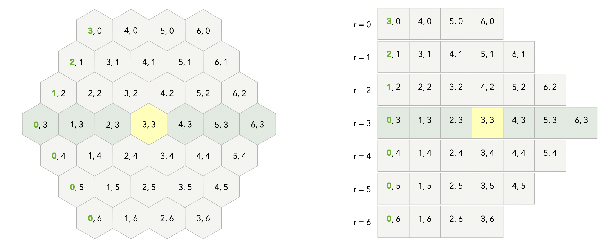

# Reversi
## Overview
This Reversi game project is a two-player game with a graphical interface. The goal is to implement
the classic Reversi game with a hexagonal grid. The codebase allows for human players to play
against each other or even the possibility of implementing AI players in future versions. For this
iteration of the homework, we have implemented a `Model` that can be used by future implementations
of controllers and views.

## Quick start
The game can be played by instantiating a concrete class that implements `IModel` (such as `Model`) 
with the number of rings as a parameter and two players (`MockPlayer` for now). 

## Invariant
- The number of key-value pairs in `board` is equal to `3 * numRings * (numRings + 1) + 1`.

## Key Components

### Model
- `IROModel` -- A read-only interface that allows the user to make observations on the model such 
as querying the game state.
- `IModel` -- A mutable interface that allows the user to make observations and operations on the 
model such as playing a move and switching turns.
- `ROModel` and `Model` -- Concrete implementations of their respective interfaces.
- `Posn` -- A Posn represents the x and y coordinates of the hexagonal grid.

**Coordinate System**

Source: [Red Blob Games](https://www.redblobgames.com/grids/hexagons/)

The y coordinate ranges from  `0` to `numRings * 2` inclusive. The x coordinate varies with each row 
to form the hexagonal shape. We implemented a dynamically resizing moving window. We can start by 
initializing a start at `numRings` and end at `numRings * 2`. Every iteration, the window increases 
in size, moving towards the left (start is decremented). Once it reaches the leftmost position 
(`0`), the end starts decrementing. This happens until the end reaches `numRings`. The above image 
shows a detailed representation of how the view would look with the above `x`, `y` coordinate
system. Note, that internally we are using a `Map` to store the coordinates instead of a 2-D array 
as shown in the image. This allows us to map each coordinate to an `Optional<Player>`.

### Player
- The `Player` interface defines only one public method called `playMove` which takes in a mutable
model. This method will be implemented differently in a human player versus a computer player. In a 
computer player, this method will compute a valid move and play it by calling the `playMove` 
method on the mutable model passed in. In a human player, this method will have no action since the
human move is an asynchronous action that will be triggered by the view. 

### View
- `TextualView` -- A light-weight text-based view to visualize the game of Reversi.

## Source organization
```.
├── README.md
├── Reversi.iml 
├── src
│       ├── Main.java
│       ├── model
│       │       ├── IModel.java
│       │       ├── IROModel.java
│       │       ├── Model.java
│       │       ├── Posn.java
│       │       └── ROModel.java
│       ├── player
│       │       ├── MockPlayer.java
│       │       └── Player.java
│       └── view
│               └── TextualView.java
└── test
    └── ReversiTests.java
```

This is the organization of all the files in the codebase. All `Model` related files are in a 
package called `model`. We have also implemented an interface for a `Player` along with a mock for 
the same in a package called `player`. Finally, we have a simple `TextualView` in a package called
`view`. This ensures that the code is organized in a logical manner, ensuring suitable visibility
and encapsulation of each of the components.

**Note:** This README file provides a high-level overview of the project. For detailed information 
about classes, interfaces, and methods, refer to the Javadoc comments within the code.

Enjoy playing Reversi!
